# Prims
3D Geometry Primitives for WebGL

Constructors return objects with the keys `vertices`, `indices`, and `normals`.  Working on adding `uvs`.  Indices should be put into at least a `Uint16Array` since the number of unique vertices will be greater than 255 (`Uint8Array`) for most geometries.  The goal is to be able to have a bunch of 3D Geometries without needing all of Three.js.

All vertice lists use hard shading for polyhedra (so each vertex is duplicated for each face).

Also contains a few meshes.  These must be loaded aync.

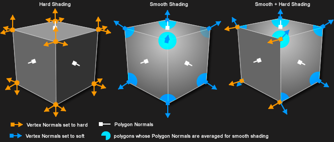

## Examples
### Tetrahedron
4 sides

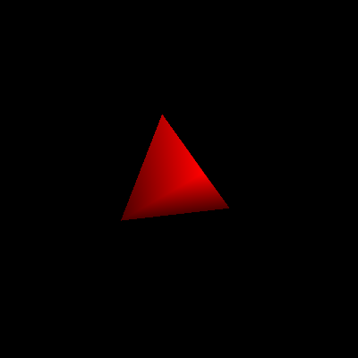

### Cube
6 sides

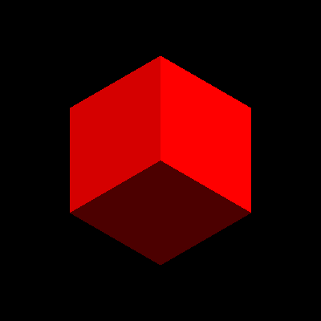

### Octahedron
8 sides

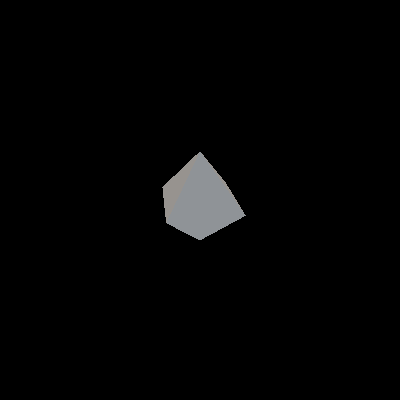

### Dodecahedron
12 sides

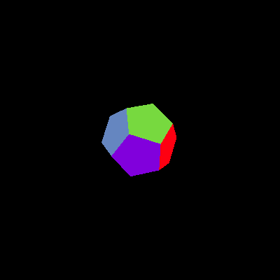

### Icosahedron
20 sides

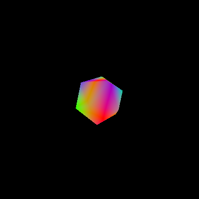

### Cylinder
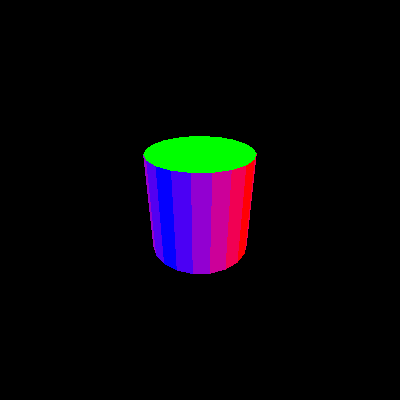

### Cone
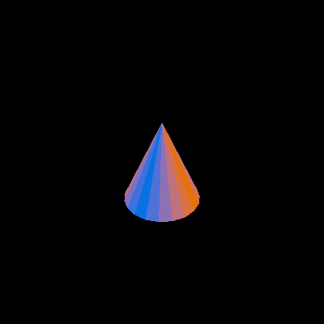

### Sphere

### Torus

### Sierpinski Triangle

### Menger Sponge
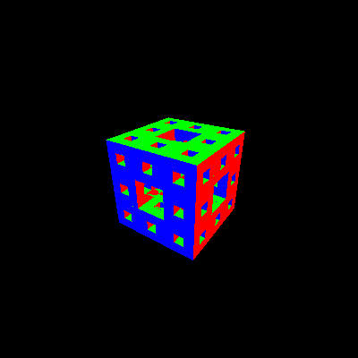

## Meshes
### Suzanne
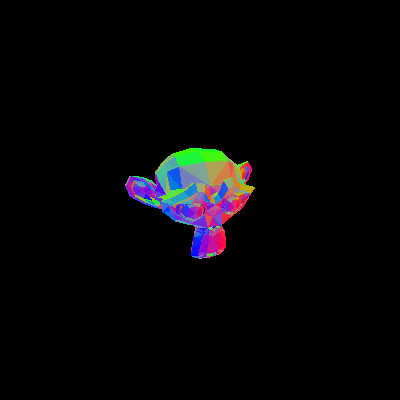

### Utah Teapot
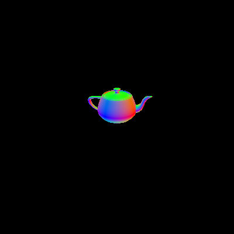

### Stanford Bunny
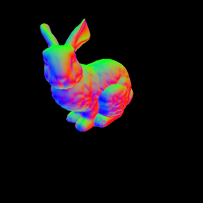

### Stanford Dragon
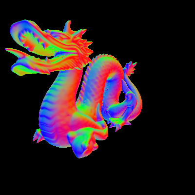

## License
"THE BEER-WARE LICENSE" (Revision 42):
<nick@mozilla.com> wrote this file. As long as you retain this notice you can do whatever you want with this stuff. If we meet some day, and you think this stuff is worth it, you can buy me a beer in return.

Nick Desaulniers

